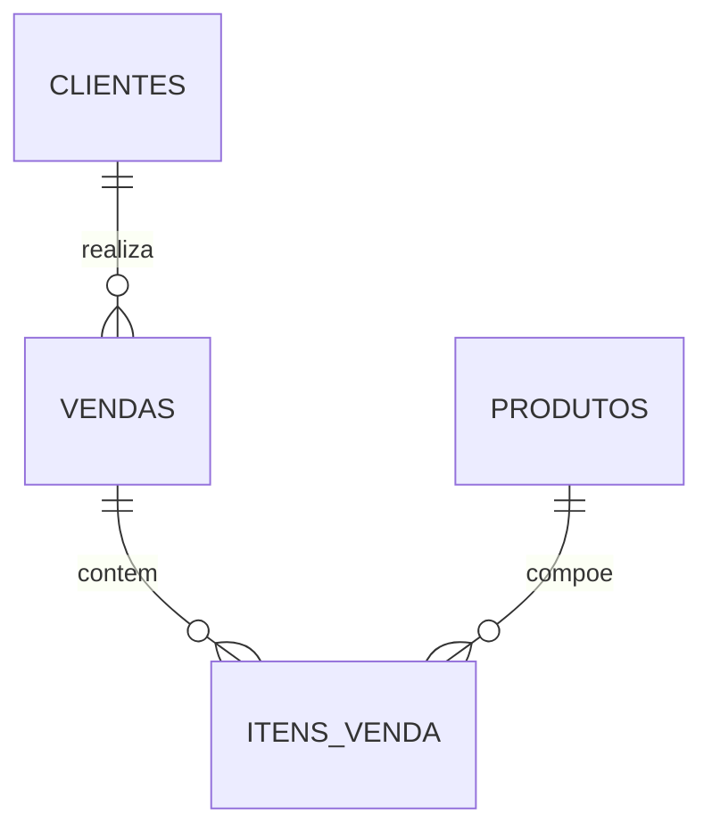

# Cenário de Dados

A fonte `data/raw/vendas.csv` representa um cenário de varejo com entidades:

- clientes
- produtos
- vendas
- itens_venda

## Modelo ER (Mermaid)

## DDL resumida
As tabelas são apresentadas no notebook `03_cenario_modelo_dados.ipynb` com chaves primárias e estrangeiras, além da explicação de colunas e relacionamentos.
